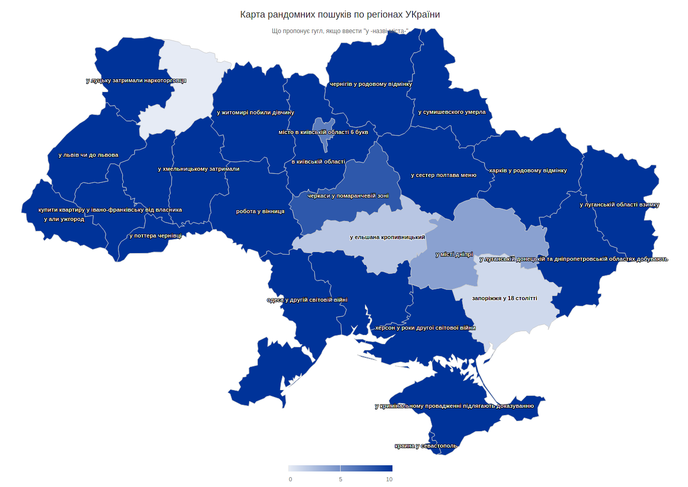

## Карта рандомних пошуків по регіонах України
Витягнення набору пошукових пропозицій за кожним регіоном, вибір рандомних варіантів і відображення їх на карті України.

Ідея взята із репозиторію @mkbodanu4'a https://github.com/mkbodanu4/ukrainian-troubles
Використано Express.js, Mustache, Nodemon, Node-Fetch.



Запуск:
```sh
yarn dev          # звичайний запуск
yarn dev:inspect  # із дебагером
```

За замовченням сервиться на http://localhost:3000/
